# 2주차(2022-03-15)

- 안드로이드스튜디오 설치 && GitHub 가입 및 레포지토리 만듬
</img>

# 3주차 과제

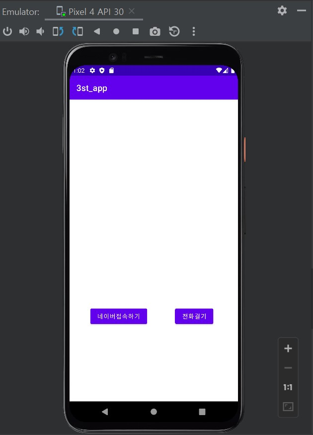</img>
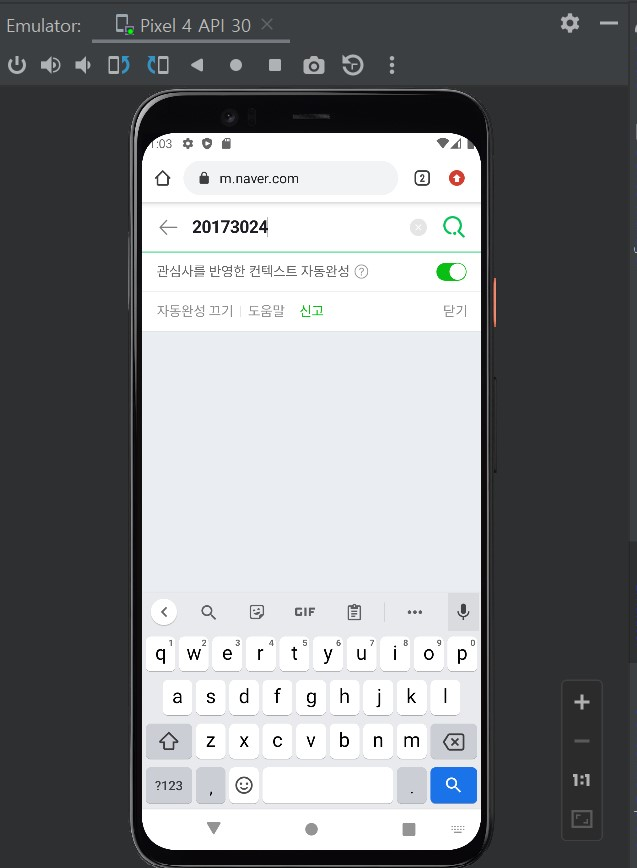</img>
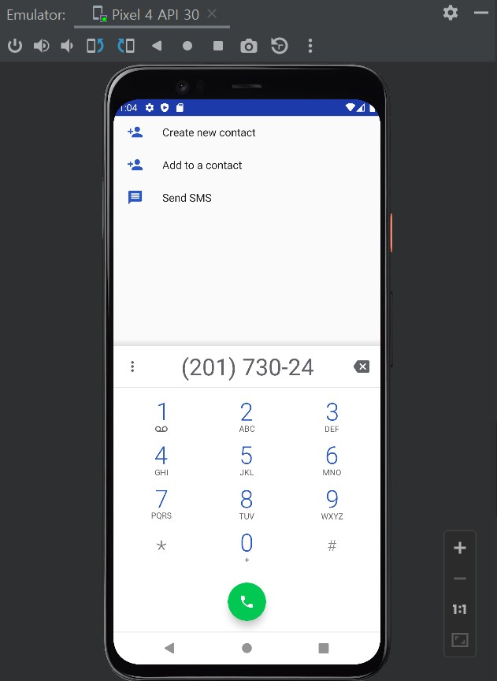</img>

# 4주차 과제

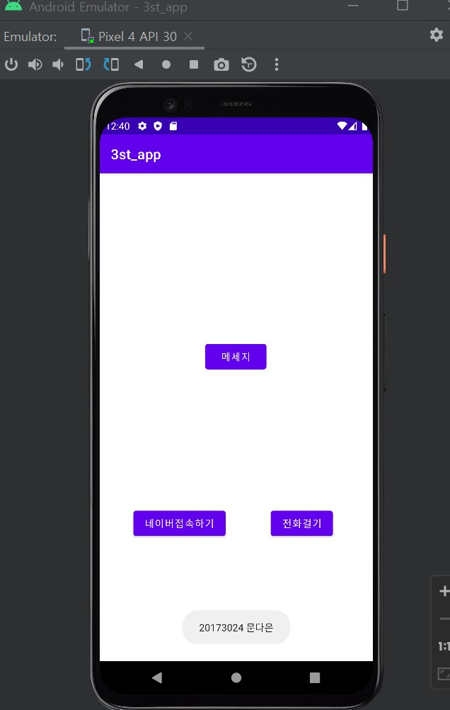</img>

# 5주차 과제

</img>
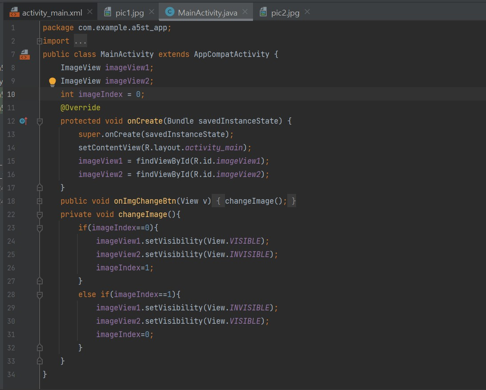</img>
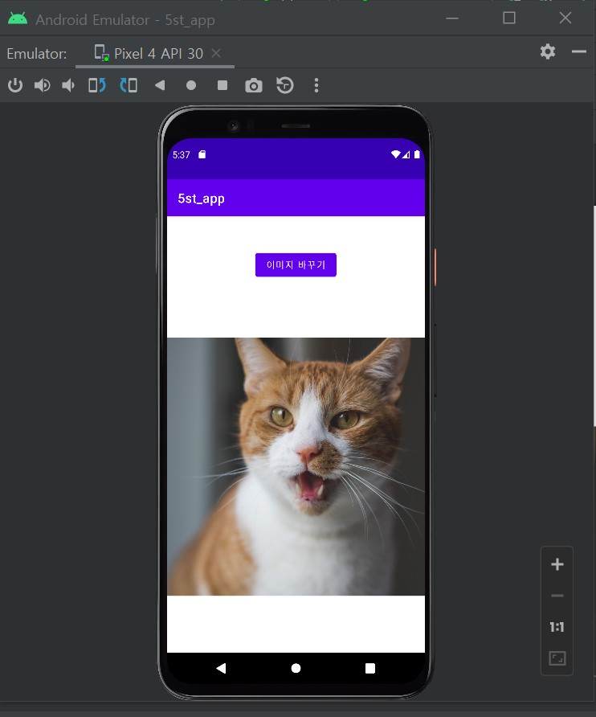</img>
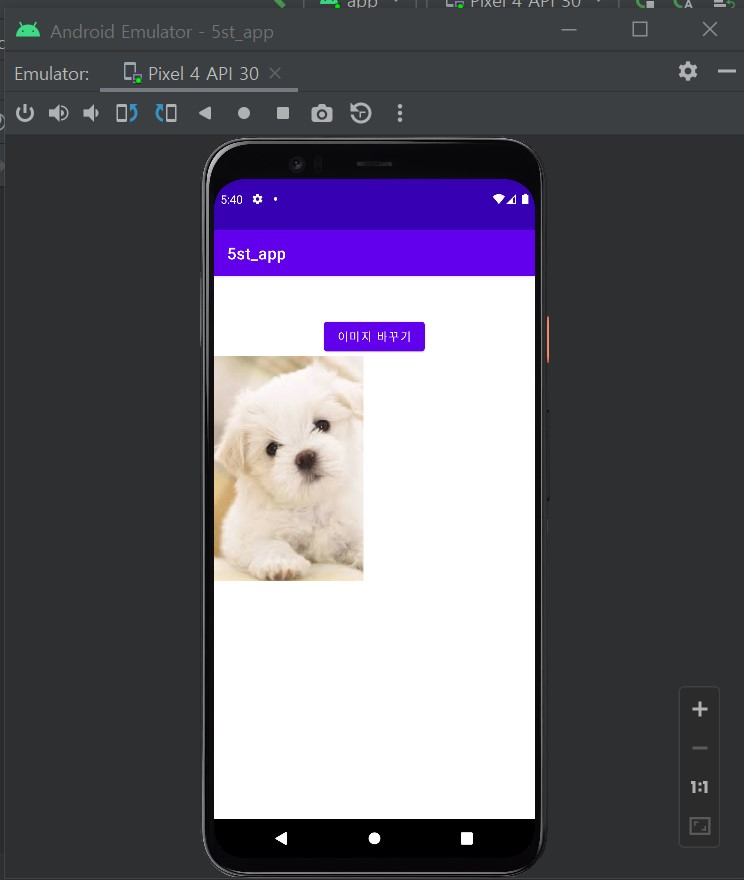</img>

# 6주차 과제

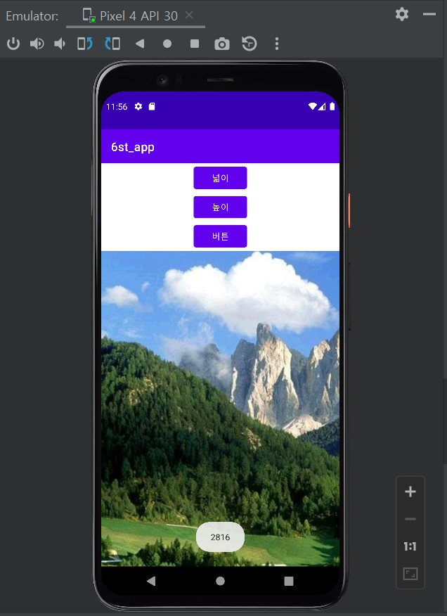</img>
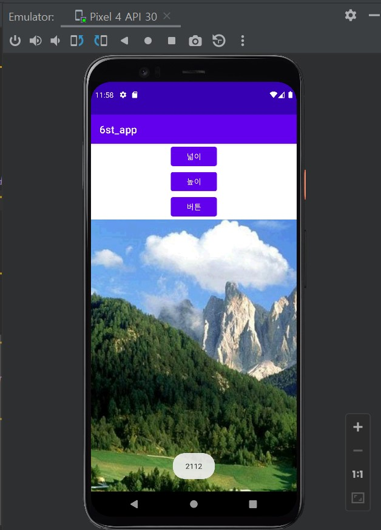</img>

# 10주차 과제

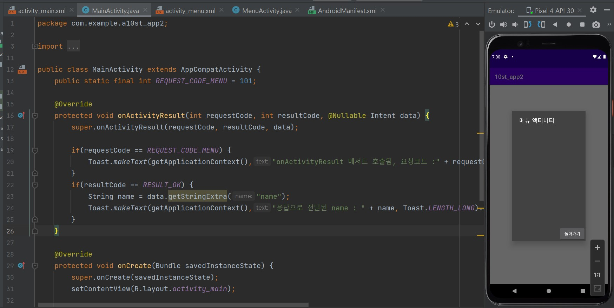</img>
</img>

# 11주차 과제

</img>

# 12주차 과제
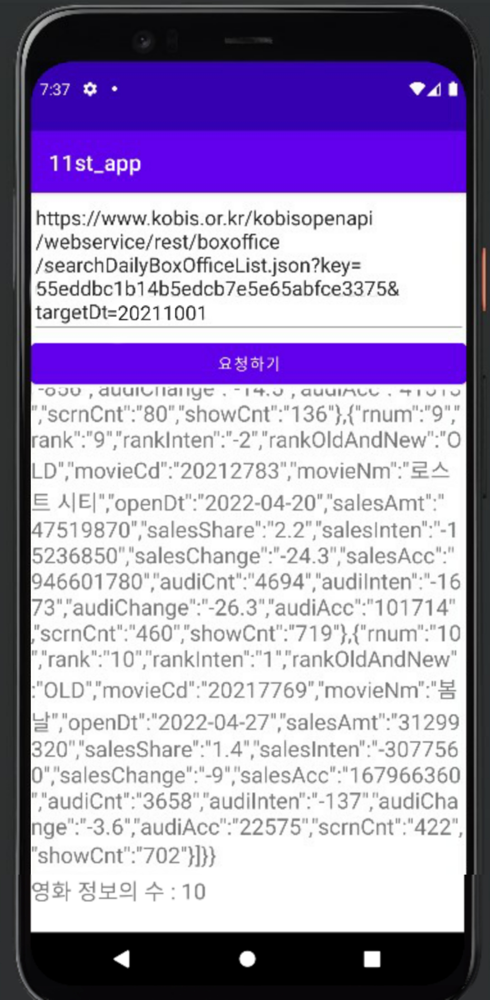</img>
